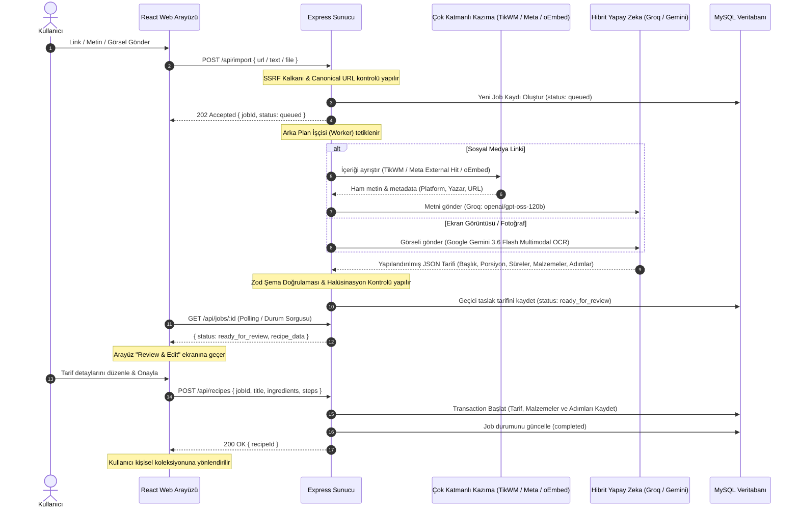

# Oneyiyo — Sosyal Medyadan Yemek Tarifi İçe Aktarma Platformu

Oneyiyo; sosyal medya (Instagram, TikTok, YouTube) ve yemek bloglarındaki serbest formatlı yemek tariflerini analiz ederek, arka planda hibrit yapay zeka mimarisi (**Groq Cloud** ve **Google Gemini**) kullanarak yapılandırılmış Türkçe yemek tariflerine dönüştüren ve kullanıcının kişisel koleksiyonunda saklayan **Fullstack (React + Node.js/Express + MySQL)** bir web uygulamasıdır.

---

## 1. Mimari Yapı ve Akış (Mermaid)

Sistem, asenkron iş modeli (Asynchronous Job Polling) ile çalışır ve veri gizliliği standartlarına tam uyumludur:



---

## 2. Temel Özellikler ve Modüller

### 2.1 Çok Katmanlı Kazıma (Scraping) Altyapısı
* **Instagram:** `facebookexternalhit/1.1` başlıkları ve oturum çerezi (`INSTAGRAM_COOKIE`) desteğiyle Instagram'ın login duvarı ve bot kısıtlamaları aşılır.
* **TikTok:** Entegre **TikWM API** motoru ile `vt.tiktok.com`, `vm.tiktok.com` kısa linkleri, video açıklamaları ve çoklu fotoğraf albümleri 1 saniyenin altında çekilir.
* **YouTube:** YouTube oEmbed endpoint'i ve altyazı çekme desteği ile video açıklamaları ayrıştırılır.
* **Yemek Blogları:** Readability ve Open Graph motoru ile web sayfalarındaki tarif makaleleri temiz metin olarak çıkarılır.

### 2.2 Hibrit Yapay Zeka (LLM) Mimarisi
* **Metin ve Link Ayrıştırma:** Hızlı ve limitsiz işlem için **Groq Cloud API** (`openai/gpt-oss-120b`) kullanılır.
* **Görsel / Ekran Görüntüsü (OCR):** Kamera veya ekran görüntüsüyle yapılan yüklemelerde **Google Gemini API** (`gemini-3.6-flash`) multimodal yetenekleriyle görseldeki metinleri ayrıştırır.
* **Halüsinasyon Filtresi:** Kaynak metinde geçmeyen uydurma sayısal miktarlar ve süreler doğrulanarak temizlenir.
* **Zod Şema Validasyonu:** Tüm LLM çıktıları katı TypeScript Zod şeması ile doğrulanır; şemaya uymayan çıktılar reddedilir.

### 2.3 Kullanıcı Deneyimi ve Güvenlik
* **Zorunlu Review & Edit:** Kayıttan önce kullanıcıya sunulan ekranda başlık, porsiyon, süreler, malzemeler ve adımlar serbestçe düzenlenebilir.
* **Dinamik Porsiyon Ölçekleme:** Tarif detay sayfasında porsiyon değiştirildiğinde malzeme miktarları otomatik olarak yeniden hesaplanır.
* **Oturum Yönetimi & Auto-Login:** Kayıt olan kullanıcılar anında JWT token üretilerek doğrudan giriş yapmış şekilde ana sayfaya aktarılır. Parolalar `bcryptjs` ile hashlenir.
* **SSRF Savunması:** Özel ağ IP'leri (`10.x`, `192.168.x`, `127.0.0.1`, `169.254.169.254`), loopback ve link-local adreslere giden istekler engellenir.
* **Veri Gizliliği:** Telif uyumluluğu gereği kaynak video veya ham içerikler depolanmaz; yalnızca kullanıcıya ait yapılandırılmış tarif nesnesi saklanır.

---

## 3. Kurulum ve Çalıştırma

### 3.1 Gereksinimler
* Node.js (v18+)
* MySQL Server (v8.0+) veya Aiven Cloud MySQL
* Groq Cloud API Anahtarı ([console.groq.com](https://console.groq.com/))
* Google Gemini API Anahtarı ([aistudio.google.com](https://aistudio.google.com/))

---

### 3.2 Backend Kurulumu

1. `backend/` dizinine geçin:
   ```bash
   cd backend
   ```

2. Bağımlılıkları yükleyin:
   ```bash
   npm install
   ```

3. `backend/.env` dosyası oluşturun ve aşağıdaki değişkenleri tanımlayın:
   ```env
   PORT=5000
   DB_HOST=localhost
   DB_PORT=3306
   DB_USER=root
   DB_PASSWORD=your_mysql_password
   DB_NAME=onedio_recipes
   
   # LLM API Anahtarları
   GROQ_API_KEY=your_groq_api_key
   GEMINI_API_KEY=your_gemini_api_key
   
   # Güvenlik & Konfigürasyon
   JWT_SECRET=your_jwt_secret_key_2026
   ALLOWED_DOMAINS=youtube.com,youtu.be,instagram.com,tiktok.com,vt.tiktok.com,vm.tiktok.com,yemek.com,nefisyemektarifleri.com,lezzet.com.tr
   RATE_LIMIT_MAX=10
   
   # İsteğe Bağlı Kazıma Ayarları
   INSTAGRAM_COOKIE=your_instagram_session_id
   ```

4. Sunucuyu geliştirme modunda başlatın (Veritabanı tabloları otomatik oluşturulacaktır):
   ```bash
   npm run dev
   ```

---

### 3.3 Frontend Kurulumu

1. `frontend/` dizinine geçin:
   ```bash
   cd ../frontend
   ```

2. Bağımlılıkları yükleyin:
   ```bash
   npm install
   ```

3. İstemci sunucusunu başlatın:
   ```bash
   npm run dev
   ```

4. Tarayıcınızda `http://localhost:5173` (veya Vite çıktısında belirtilen port) adresini açarak uygulamayı kullanabilirsiniz.

---

## 4. API Uç Noktaları (Endpoints)

| Yöntem | Endpoint | Açıklama | Yetki |
| :--- | :--- | :--- | :--- |
| `POST` | `/api/auth/register` | Yeni kullanıcı kaydı oluşturur ve otomatik JWT döner | Herkese Açık |
| `POST` | `/api/auth/login` | E-posta ve şifre ile oturum açar | Herkese Açık |
| `POST` | `/api/import` | Link, metin veya görsel içe aktarma işi (job) başlatır | Kullanıcı |
| `GET` | `/api/jobs/:id` | Asenkron işin durumunu ve çıkarılan tarifi sorgular | Kullanıcı |
| `GET` | `/api/recipes` | Kullanıcının kaydettiği tarif koleksiyonunu listeler | Kullanıcı |
| `GET` | `/api/recipes/:id` | Belirli bir tarifin detayını ve malzemelerini getirir | Kullanıcı |
| `PUT` | `/api/recipes/:id` | Kayıtlı tarif bilgilerini günceller | Kullanıcı |
| `DELETE`| `/api/recipes/:id` | Tarifi kalıcı olarak siler | Kullanıcı |
| `GET` | `/api/health` | Sunucu ve veritabanı sağlık durumunu döner | Herkese Açık |

---

## 5. Canlı Ortam Dağıtımı (Deployment)

* **Backend API:** Render Cloud üzerinde barındırılmaktadır.
* **Frontend UI:** Vercel üzerinde barındırılmaktadır.
* **Veritabanı:** Aiven Cloud MySQL 8.0 servisi ile 7/24 yönetilmektedir.
