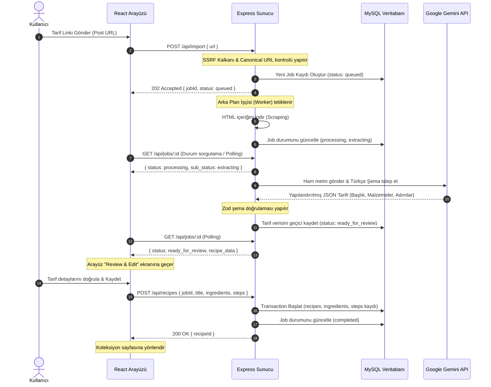

# Oneyiyo — Sosyal Medyadan Yemek Tarifi İçe Aktarma Platformu

Oneyiyo, sosyal medya (Instagram, TikTok, YouTube) ve yemek blogu linklerini analiz ederek, arka planda **Yapay Zeka (Gemini 3.6-flash)** kullanarak bunları yapılandırılmış Türkçe yemek tariflerine dönüştüren ve kullanıcının kişisel koleksiyonunda saklayan **Full-stack (React + Node.js/Express + MySQL)** bir web uygulamasıdır.

---

## 🏗️ 1. Mimari Yapı ve Akış (Mermaid)

Projenin asenkron çalışma modeli (Asynchronous Job Polling) ve veri gizliliği akışı aşağıdaki gibidir:



---

## 🔒 2. Güvenlik ve Doğrulama Özellikleri

1.  **SSRF Shield (Güvenlik Kalkanı):** Keyfi URL girişlerinde sunucunun iç ağa saldırmasını engellemek için, talep edilen alan adının IP adresi çözümlenir ve yerel IP blokları (`127.0.0.1`, `10.0.0.0/8`, `169.254.169.254` vb.) otomatik olarak engellenir.
2.  **Domain Allowlist (Alan Adı Beyaz Listesi):** Sadece izin verilen platformlardan (YouTube, Instagram, TikTok, Yemek.com, Nefisyemektarifleri, Lezzet) gelen linkler işlenir. Bu liste `.env` üzerinden dinamik yönetilir.
3.  **Çok Kullanıcılı Güvenlik (Data Isolation):** Her kullanıcının kaydettiği tarifler ve asenkron işler veritabanında `user_id` ile izole edilir. Giriş yapmamış kişiler tarifleri göremez, API seviyesinde rota doğrulaması (JWT) bulunur.
4.  **Rate Limiting:** `/api/import` endpoint'ine IP başına dakikada maksimum istek sınırı konularak API'nin suistimal edilmesi engellenir.
5.  **Katı Şema Validasyonu (Zod):** Gemini modelinin ürettiği JSON verisi veritabanına yazılmadan önce backend'de Zod şeması ile zorunlu kontrolden geçirilir.

---

## 🛠️ 3. Kurulum ve Çalıştırma

### ⚙️ 3.1 Gereksinimler
- Node.js (v18+)
- MySQL Server (v8.0+)
- Google Gemini API Anahtarı (Standard Gmail hesabı ile [Google AI Studio](https://aistudio.google.com/)'dan ücretsiz alınabilir).

---

### 🗄️ 3.2 Veritabanı Kurulumu
1.  MySQL Workbench'i veya tercih ettiğiniz bir veritabanı yönetim aracını açın.
2.  Veritabanı root kullanıcısı şifrenizi hazır bulundurun.
3.  Projenin otomatik tablo oluşturma ve veritabanı ilklendirme scripti bulunmaktadır, manuel şema yazmanıza gerek yoktur.

---

### 🌐 3.3 Backend Kurulumu
1.  `backend/` dizinine geçin:
    ```bash
    cd backend
    ```
2.  Bağımlılıkları yükleyin:
    ```bash
    npm install
    ```
3.  `backend/.env` dosyası oluşturun ve aşağıdaki şablona göre doldurun:
    ```env
    PORT=5000
    DB_HOST=localhost
    DB_PORT=3306
    DB_USER=root
    DB_PASSWORD=your_mysql_password
    DB_NAME=onedio_recipes
    GEMINI_API_KEY=your_gemini_api_key
    ALLOWED_DOMAINS=youtube.com,youtu.be,instagram.com,tiktok.com,yemek.com,nefisyemektarifleri.com,lezzet.com.tr
    RATE_LIMIT_MAX=10
    JWT_SECRET=oneyiyo-super-gizli-anahtar-2026
    ```
4.  Sunucuyu geliştirme modunda başlatın (Veritabanı ve tablolar otomatik oluşturulacaktır):
    ```bash
    npm run dev
    ```

---

### 🎨 3.4 Frontend Kurulumu
1.  `frontend/` dizinine geçin:
    ```bash
    cd ../frontend
    ```
2.  Bağımlılıkları yükleyin:
    ```bash
    npm install
    ```
3.  Arayüz sunucusunu ayağa kaldırın:
    ```bash
    npm run dev -- --port 3000
    ```
4.  Tarayıcınızda `http://localhost:3000` adresini açarak uygulamayı test edebilirsiniz!
